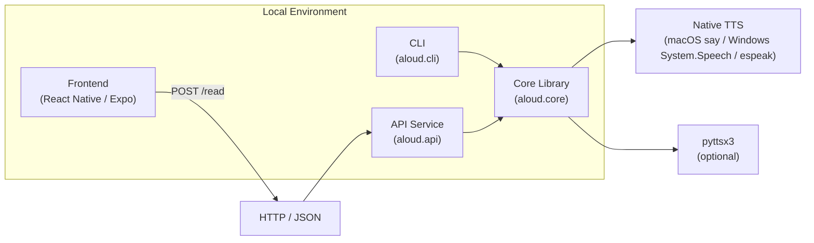

# Read Aloud

Read text or websites aloud using native TTS on macOS, Windows, or Linux. Includes:
- Core library (`aloud.core`)
- CLI (`aloud.cli`)
- API service (`aloud.api`)
- React Native (Expo) frontend

## Architecture



## Install

```sh
pip install -e .
```

Dev tools:

```sh
pip install -e .[dev]
```

## CLI

```sh
aloud --url https://example.com
aloud --file notes.txt
aloud "Hello, this is a test."
echo "Piping works too" | aloud
```

Options:

```sh
aloud --list-voices
aloud --url https://example.com --voice "Alex" --speed 1.2
```

## API

Run:

```sh
python3 -m uvicorn aloud.api:app --reload
```

Endpoints:
- `GET /health`
- `GET /voices`
- `POST /read` (body: `{ "text": "...", "voice": "...", "speed": 1.0 }` or `{ "url": "..." }`)
- `POST /stop`

Only one of `text` or `url` is allowed per request.

## Frontend (Expo)

Install dependencies:

```sh
make frontend-install
```

Run web UI:

```sh
make dev
```

The web UI appears at `http://localhost:19006` by default.

## Make Targets

- `make install` / `make install-dev`
- `make build`
- `make test`
- `make format`
- `make lint`
- `make deploy` (API only)
- `make dev` (API + Expo web)
- `make clean`
- `make architecture-png`
