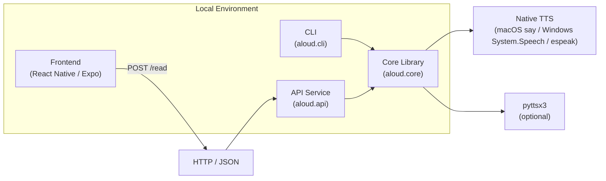

# Architecture

This repo is organized into a core library, a CLI, an API service, and a
React Native frontend.



## Render to PNG

Install Mermaid CLI once (from the repo root):

```sh
npm install --prefix frontend @mermaid-js/mermaid-cli
```

Then render:

```sh
make architecture-png
```

Output: `architecture/diagram.png`
